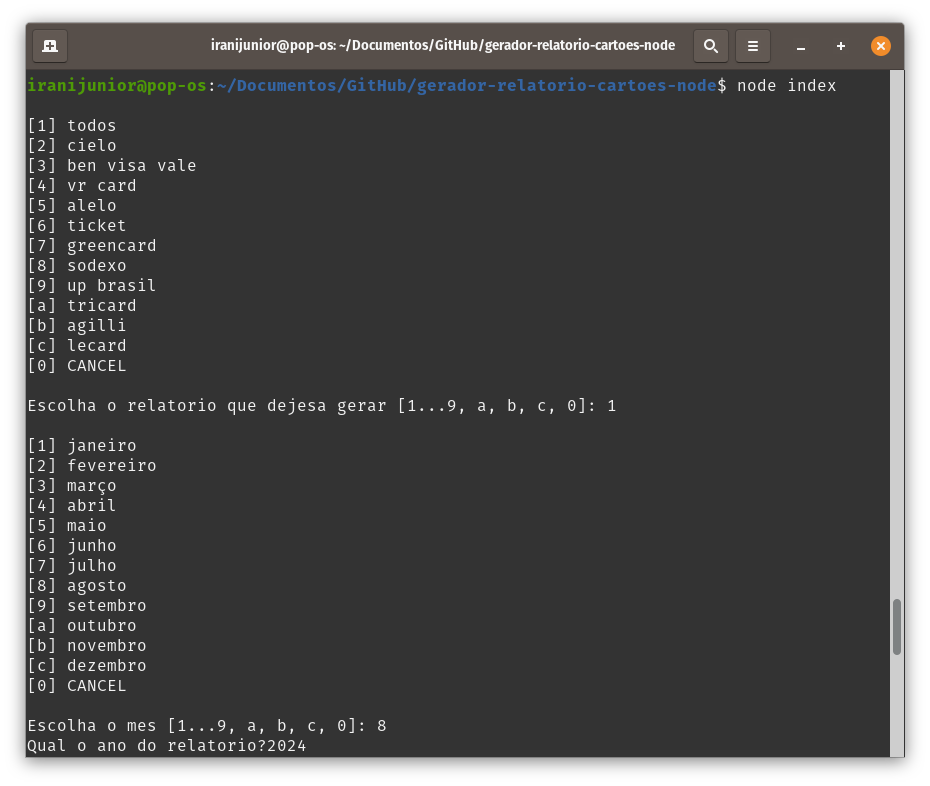
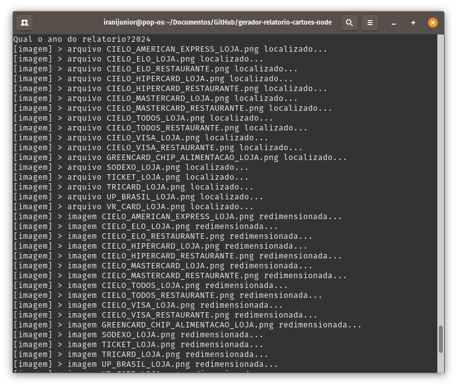
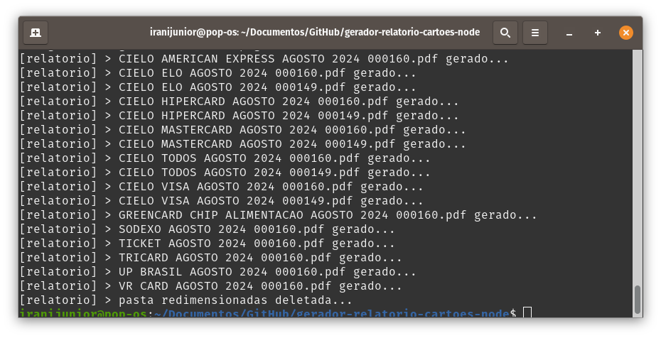

# Gerador Relatório De Cartões NodeJS

### 💻 Sobre o projeto

- Gerador Relatório De Cartões NodeJS – é um projeto desenvolvido com intuito de otimizar a tarefa de montar relatórios mensais no setor financeiro da empresa Atacadão Vicunha LTDA, além de servir como pratica para exercitar conceitos importantes do JavaScript utilizando do NodeJS.

- O projeto em sim se baseia na construção de três “ROBOS” cada um com funções bem definidas dentro do sistema geral:  

1 - "Robo Input" é responsável por receber os dados de entrada do usuário identificando as informações necessárias para gerar os relatórios.

  

2 - "Robo Imagem" é responsável por verificar os prints dos extratos na pasta indicada, validar, redimensionar e logo após salvar em outra pasta as imagens redimensionadas.

  

3 - "Robo Relatório" é responsável por gerar os relatórios de fato, montando um arquivo PDF com as informações especificas.

  

### 🎨 Layout

- A baixo o design da aplicação em execução.

    

### 🛠 Tecnologias

- As seguintes ferramentas foram usadas na construção do projeto:

- JAVASCRIPT
- NODEJS (readline-sync, sharp, jspdf)

### 📝 Licença

- Fique a vontade para contribuir...

- Feito com ❤️ por Irani Junior 👋🏽